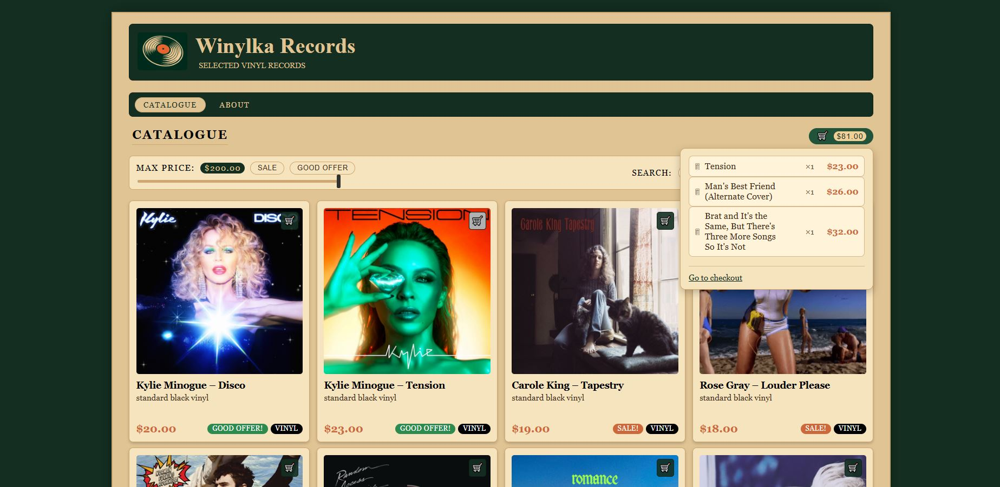
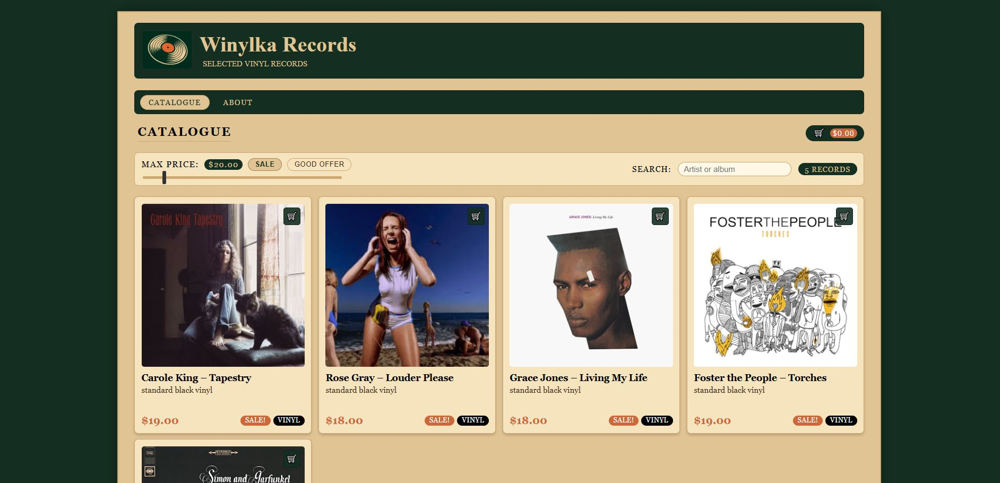
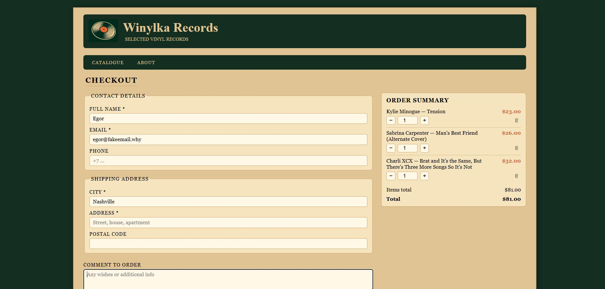
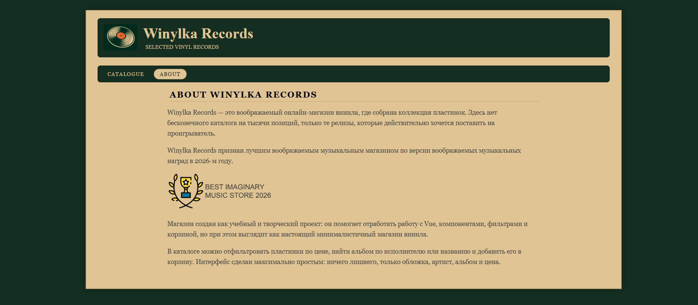

# Winylka Shop

Winylka Shop is a learning full-stack e-commerce project for a fictional vinyl record store. It combines a Vue 3 frontend with a Spring Boot REST API and demonstrates product browsing, filtering, shopping cart management and order checkout.

---

## 🛠️ Tech Stack

### Frontend

- Vue 3
- Vite
- Vue Router
- Axios
- JavaScript
- HTML
- CSS

### Backend

- Java 17
- Spring Boot 3
- Spring Web
- REST API
- Maven
- Embedded Tomcat



---

## 🚀 Features

- Browse a catalogue of vinyl records
- Search albums by artist or title
- Filter products by price
- Filter special offers
- Shopping cart with quantity management
- Order summary with live total calculation
- Checkout page with customer information
- Order submission via REST API
- Responsive component-based Vue architecture
- Retro-inspired record store interface

---

## 💡 Main Functionality

### 💿 Product Catalogue

Browse a collection of vinyl records with:

- Album artwork
- Artist and album title
- Product price
- Product labels
- Quick add-to-cart button

### 🔍 Search & Filtering

Users can easily find records using:

- Artist or album search
- Maximum price filter
- Offer filters

### 🛒 Shopping Cart

The shopping cart supports:

- Adding products
- Removing products
- Updating quantities
- Automatic total price calculation
- Session-based cart (Spring Boot version)

### 📦 Checkout

Customers can place an order by providing:

- Contact information
- Shipping address
- Order comments

The order is submitted to the Spring Boot REST API.

---

## 📸 Screenshots

### Catalogue



### Checkout



### About Page



---

## 📦 Installation

### Frontend

Clone the repository:

```bash
git clone https://github.com/egor-no/winylka-shop.git
cd winylka-shop
```

Install dependencies:

```bash
npm install
```

Run the development server:

```bash
npm run dev
```

---

### Full Stack Version

Navigate to the full-stack version:

```bash
cd back-and-front-vresion
```

Run the Spring Boot backend:

```bash
mvn spring-boot:run
```

Start the Vue frontend:

```bash
npm install
npm run dev
```
