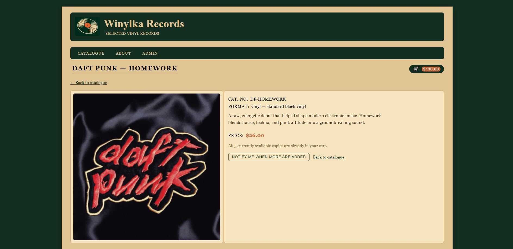
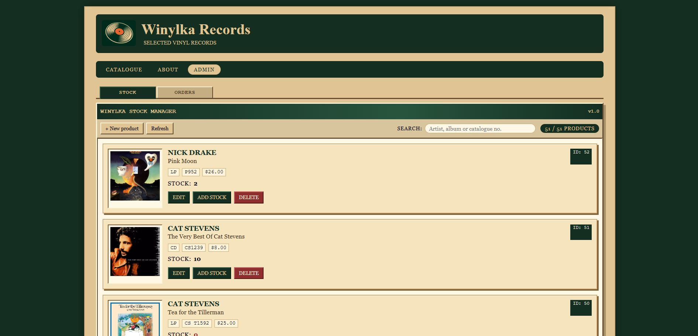
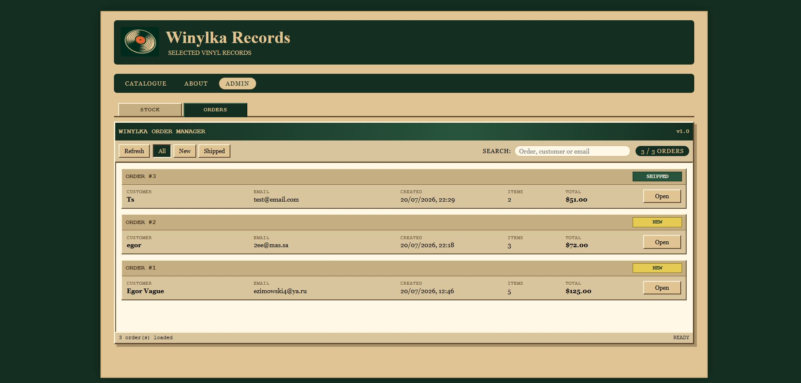

# Winylka Shop

Winylka Shop is a learning full-stack e-commerce project for a fictional vinyl record store. It combines a Vue 3 frontend with a Spring Boot REST API backed by PostgreSQL and demonstrates product browsing, filtering, shopping cart management and order processing.

---

## 🛠️ Tech Stack

### Frontend

- Vue 3
- Vite
- Vue Router
- Axios
- JavaScript
- HTML
- CSS

### Backend

- Java 17
- Spring Boot 3
- Spring Web
- Spring Events
- PostgreSQL
- REST API
- JUnit 5
- Mockito
- Maven
- Embedded Tomcat


---

## 🚀 Features

- Browse a catalogue of vinyl records
- Product search and price filtering
- Sale & Good Offer labels
- Out-of-stock handling
- Shopping cart with stock validation
- Customer checkout
- Admin dashboard
- Product management
- Inventory restocking
- Order management & shipment tracking
- Product image upload
- Customer restock subscriptions
- Domain events using Spring Events
- Event-driven notification architecture
- PostgreSQL persistence
- Unit tests with JUnit 5 & Mockito

---

## 💡 Main Functionality

### 💿 Product Catalogue

Browse a collection of vinyl records with:

- Album artwork
- Artist and album title
- Product price
- Product labels
- Quick add-to-cart button

### 🔍 Search & Filtering

Users can easily find records using:

- Artist or album search
- Maximum price filter
- Offer filters

### 🛒 Shopping Cart

The shopping cart supports:

- Adding products
- Removing products
- Updating quantities
- Automatic total price calculation
- Session-based cart (Spring Boot version)

### 📦 Checkout

Customers can place an order by providing:

- Contact information
- Shipping address
- Order comments

The order is submitted to the Spring Boot REST API.

---

## ⚙️ Backend Highlights

The backend follows a layered architecture with:

- REST API
- Service layer
- Repository pattern
- PostgreSQL persistence
- DTO-based communication
- Domain events using Spring Application Events
- Transactional event listeners
- Unit tests with Mockito

Current domain events:

- ProductRestockedEvent
- OrderShippedEvent

The notification layer is intentionally decoupled from the business logic, allowing local Spring events to be replaced with Kafka with minimal changes.

---

## 📸 Screenshots

### Catalogue


### Checkout


### About Page


### Product Page (Restock Subscription)



### Admin Stock Management



### Admin Order Management



---

## 📦 Installation

### Frontend

Clone the repository:

```bash
git clone https://github.com/egor-no/winylka-shop.git
cd winylka-shop
```

Install dependencies:

```bash
npm install
```

Run the development server:

```bash
npm run dev
```

---

### Full Stack Version

Navigate to the full-stack version:

```bash
cd back-and-front-vresion
```

Run the Spring Boot backend:

```bash
mvn spring-boot:run
```

Start the Vue frontend:

```bash
npm install
npm run dev
```

## 🔜 Planned Features

- Kafka integration
- Email notifications
- Authentication & authorization
- Docker support
- Payment simulation
- Product categories